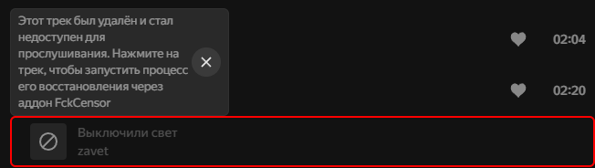

**Обновление FckCensor v2.0.0**

Аддон *масштабно* обновился, добавляя еще больше возможностей.

1. **Аддон теперь может возвращать заблокированные треки**: с помощью FckCensor теперь можно подменивать не только треки с блюром, но и треки, которые стали недоступны для прослушивания. Это делается буквально в пару кликов. 
2. **Подменивать теперь можно не только аудиопоток, но и любую другую информацию**: функционал аддона больше не ограничевается только возможностью подменить аудиопоток при воспроизведении трека. Теперь кнопка «Подменить трек» открывает окно, в котором можно изменить *любое* свойства треков: от названия трека, до его исполнителей. 
3. **Помимо треков, теперь можно подменивать исполнителей и альбомов**: можно менять любые свойства альбомов и исполнителей, но помимо этого теперь на их страницы можно добавлять любые треки. 

