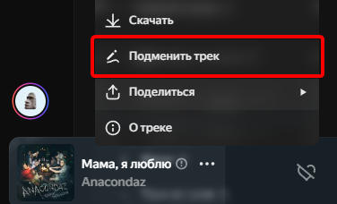
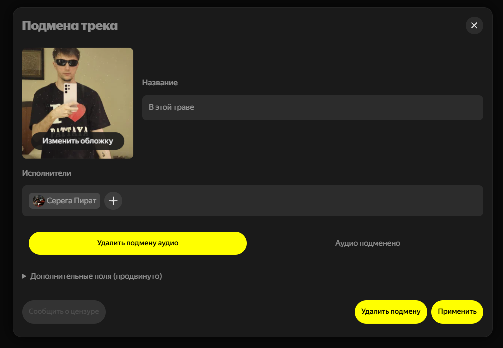
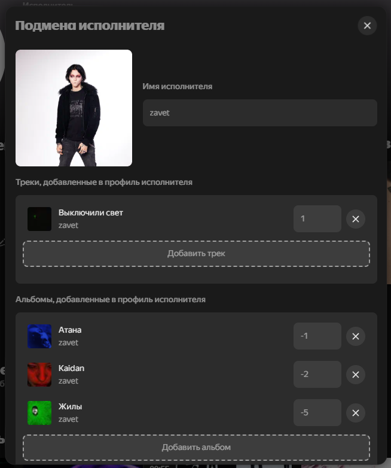
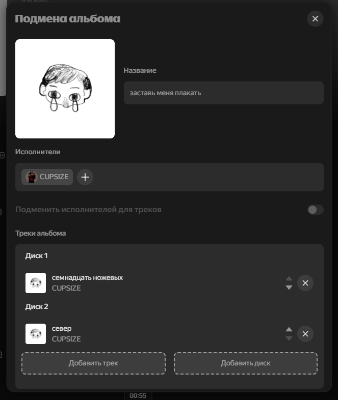

# FckCensor (обход запикивания/цензуры)

> [!CAUTION]
> Версия 2.0.0 находится на стадии разработки, в репозитории представлен не законченный прогресс, не рекомендуется к сборке и использованию до официального релиза.

> [!TIP]
> [Инструкция к использованию аддона](https://github.com/Hazzz895/FckCensor/blob/v2/FAQ.md)

Аддон позволяет легко подменить любую информацию альбомов, исполнителей и треков (включая аудиопоток), а также автоматически подменивает вышеперечисленную информацию, если такова есть в [удалённом списке](https://github.com/Hazzz895/FckCensorData/blob/main/README.md)

