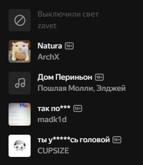
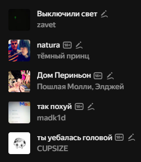
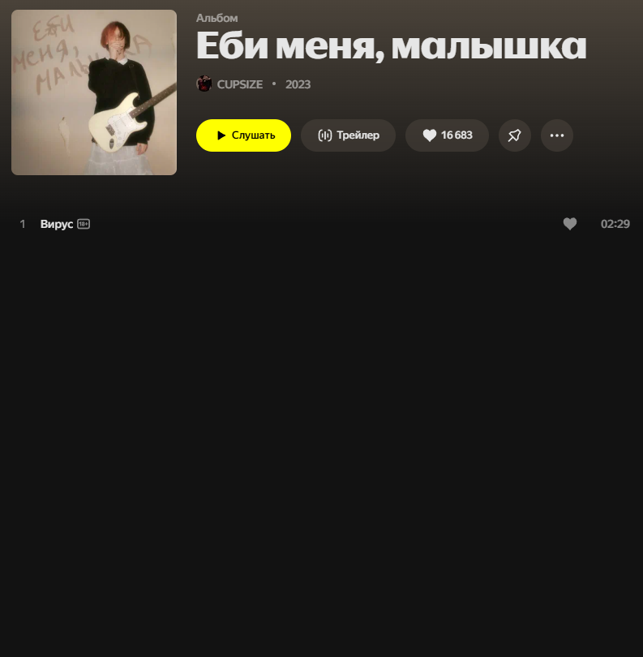
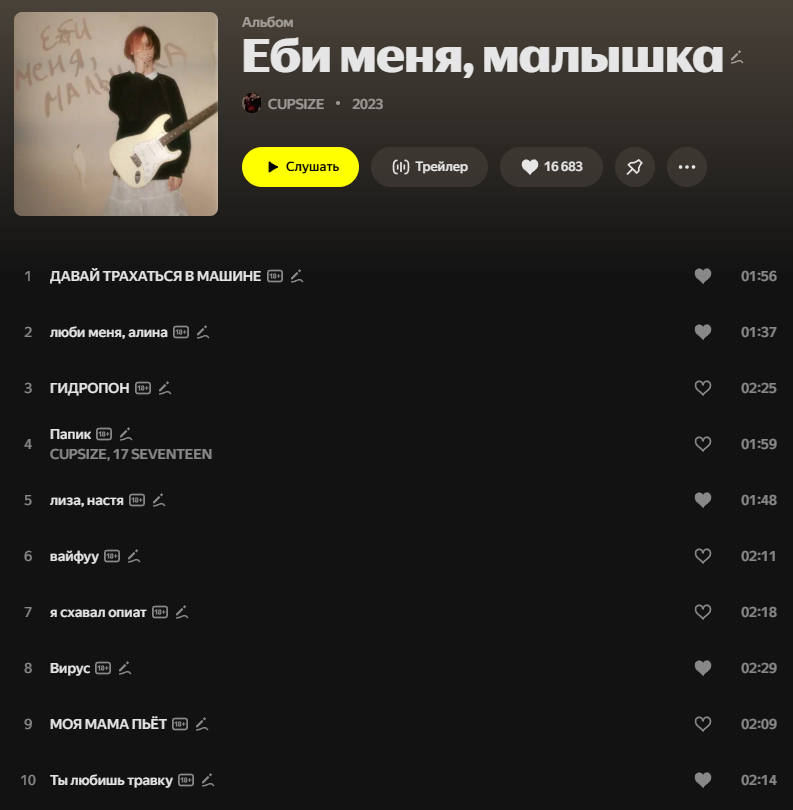
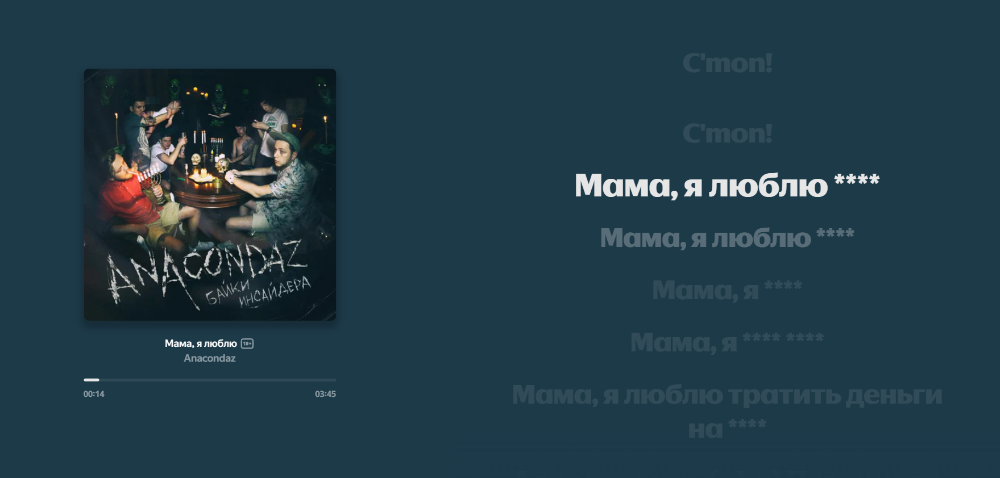
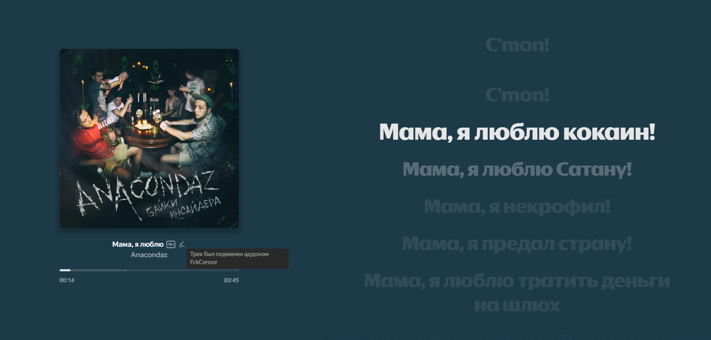
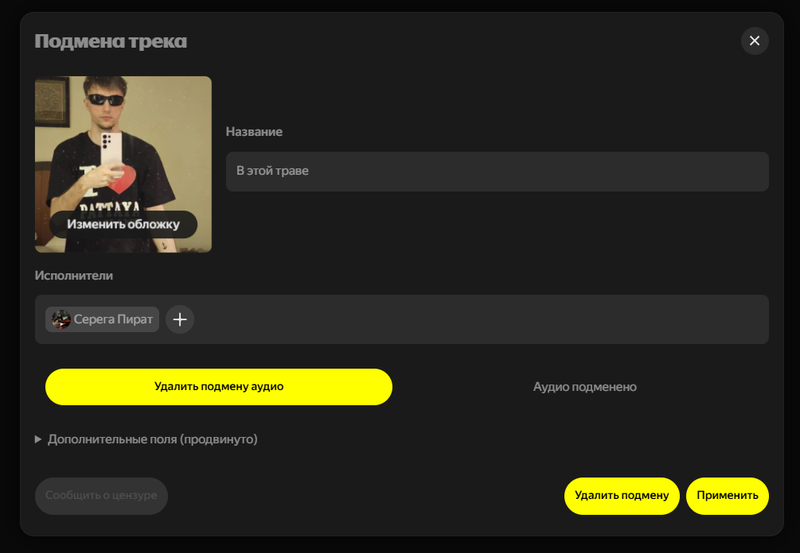
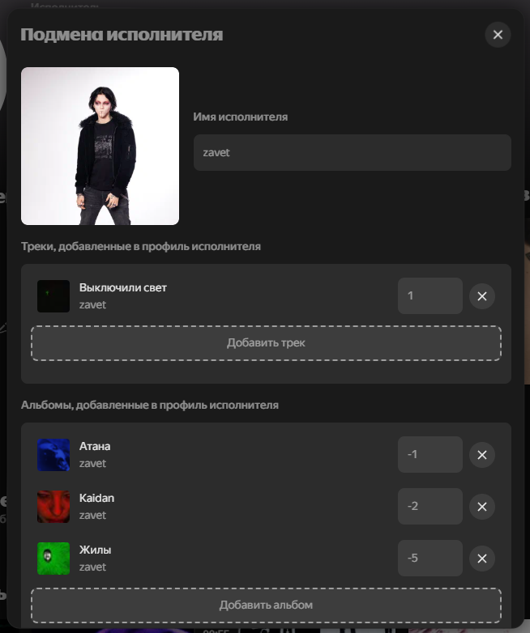
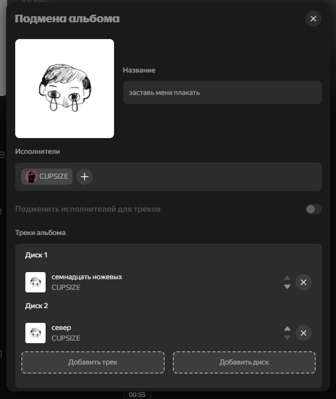

    

    <h1 style="justify-content: center; align-items: center; display: flex; text-align: center">
        FckCensor (обход запикивания / цензуры)
    </h1>

<b>FckCensor</b> — аддон на Яндекс Музыку, позволяющий легко подменить любую информацию альбомов, исполнителей и треков (включая аудио), а также автоматически подменивает вышеперечисленную информацию, если такова есть в <a href="https://github.com/Hazzz895/FckCensorData/blob/main/README.md">удалённом списке</a>.

 

<h2 style="text-align: center">Демонстрация аддона FckCensor</h2>
<table>
  <thead>
    <tr>
      <th style="text-align: center;">Без аддона</th>
      <th  style="text-align: center;">С аддоном FckCensor</th>
    </tr>
  </thead>
  <tbody>
    <tr>
      <td>
        
      </td>
      <td>
        
      </td>
    </tr>
    <tr>
        <td colspan="2" style="font-style: italic; color: gray; text-align: center;">
            Аддон может восстанавливать удалённые треки, соотносить перезаливы с настоящими исполнителями и убирать цензуру с названий и обложек
        </td>
    </tr>
    <tr>
      <td>
        
      </td>
      <td>
        
      </td>
    </tr>
    <tr>
        <td colspan="2" style="font-style: italic; color: gray; text-align: center;">
            С помощью аддона возможно восстановить удалённые треки с альбома
        </td>
    </tr>
    <tr>
      <td>
        
      </td>
      <td>
        
      </td>
    </tr>
    <tr>
        <td colspan="2" style="font-style: italic; color: gray; text-align: center;">
            Запикивания и цензура во время прослушивания также полностью убирается через аддон
             
            * Аддон не убирает цензуру с текстов. Текст трека был визуально зацензурен для демонстрации функционала.
        </td>
    </tr>
  </tbody>
</table>

## Скриншоты работы с аддоном

